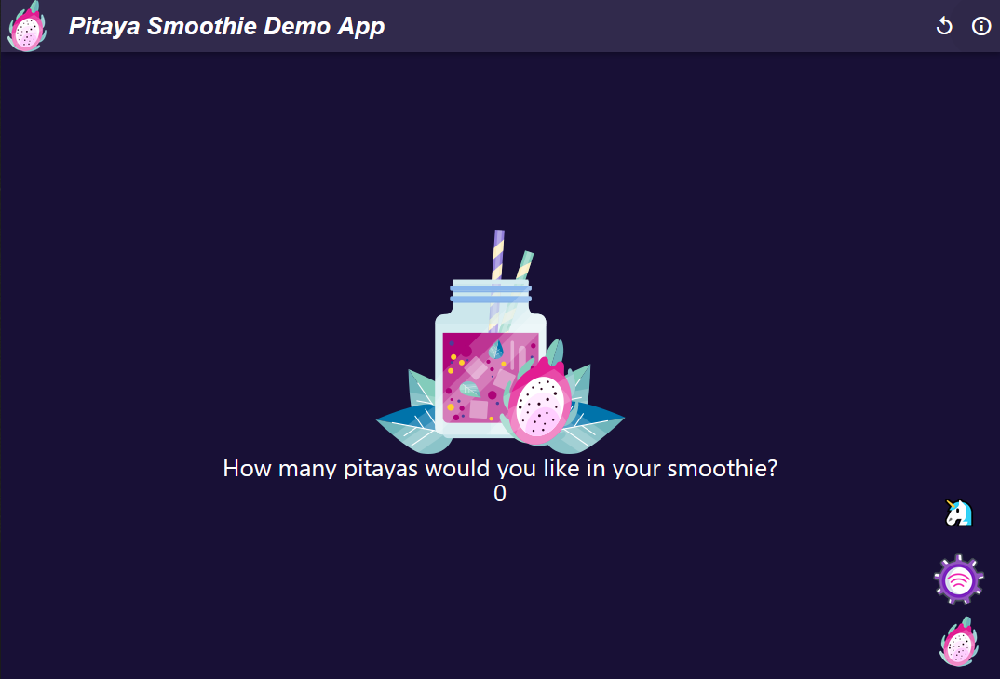
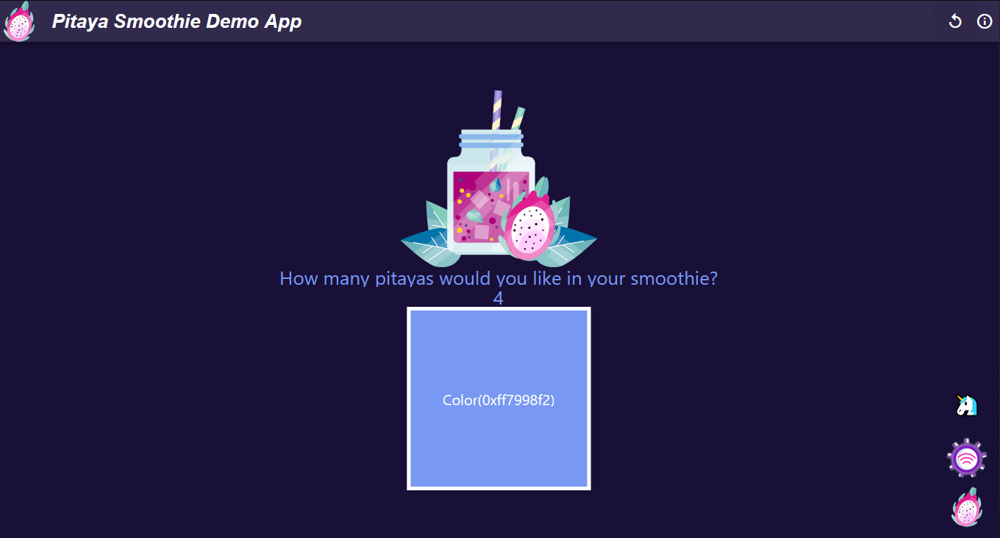
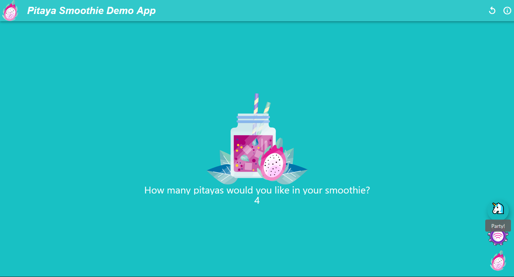
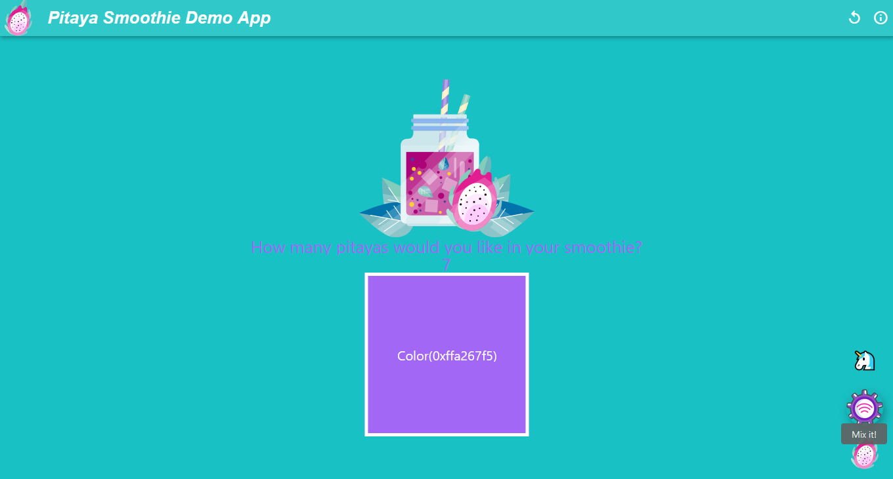
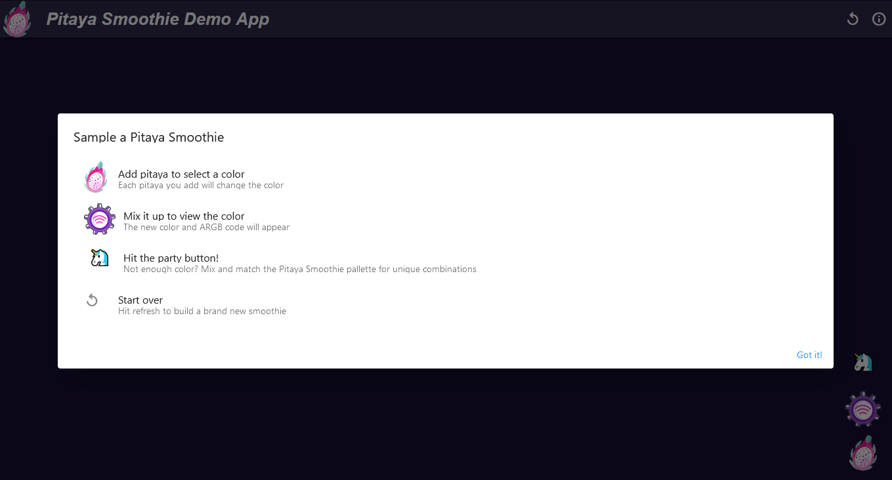

# pitaya-smoothie-demo

**A demo Flutter web app showcasing the Pitaya Smoothie theme's color palette.**

This project grew out of a request from [Tania Allard](https://github.com/trallard) to add some Dart code to the [Pitaya Smoothie](https://github.com/trallard/pitaya_smoothie) repo for testing purposes. This was the perfect excuse for me to write up a quick app to explore building and deploying Flutter for the web. I also had a chance to experiment with button animations and multiple (stacked) Floating Action Buttons.

## About the App

Pitaya Smoothie is one of my go-to VS Code themes because

- It's easy on my eyes in all lighting (it's strongly focused on accessibility, after all);
- It looks great with several languages; and
- It's designed around [Ultraviolet (Pantone 18-3838)](https://www.pantone.com/articles/color-of-the-year/color-of-the-year-2018), which is an awesome color!

To showcase this awesome color palette, I built two main functions into the app:

1. Display any of the colors against the Ultra Violet background (along with its ARGB code)
    - Add any number of Pitayas to your "smoothie", and then `Mix it!` to see the corresponding color.

2. Randomly mix and match any two Pitaya Smoothie colors and re-theme the app hitting the `Party!` (unicorn) button.
    - Adding/mixing pitayas after re-theming keeps the new background color

The app also includes built-in instructions (info button) in case you can't remember what the buttons do.

And that's it!

[Enjoy!](https://aedwardg.github.io/pitaya-smoothie-demo)
